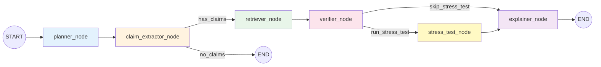
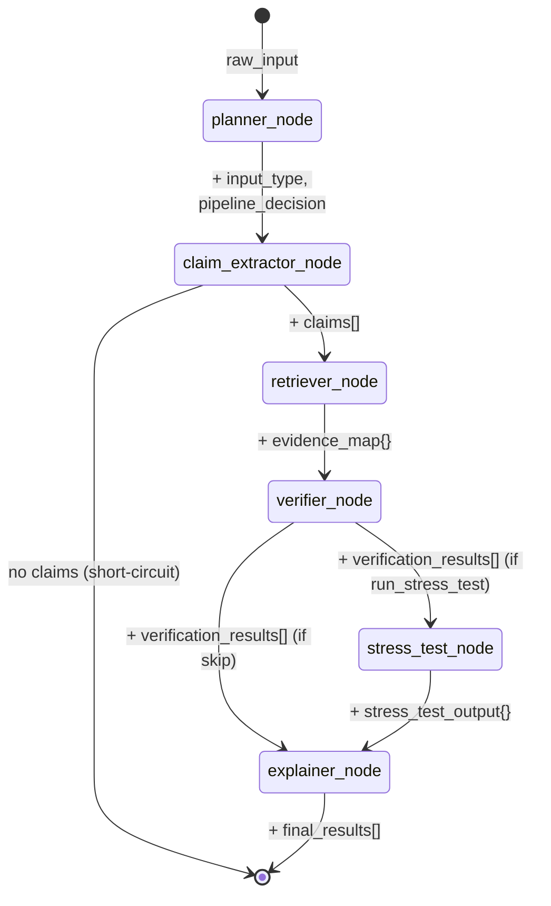
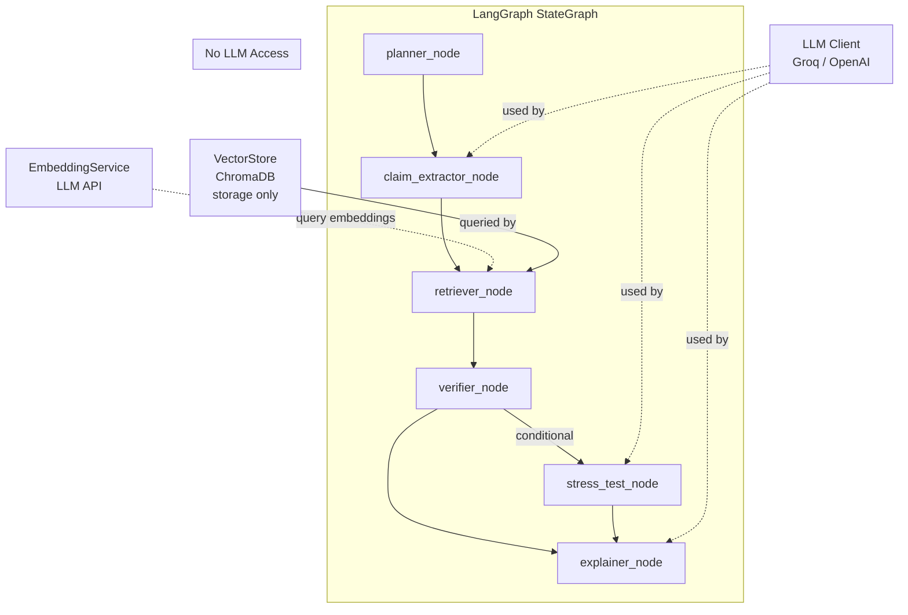
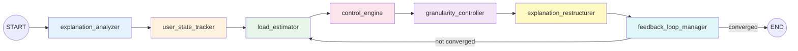

# AI Reasoning Engine

> This module implements a **graph-native multi-agent reasoning system** using LangGraph StateGraph. All agent logic exists as **pure functions** (graph nodes) operating on shared state. There are NO agent classes. The pipeline order is non-negotiable.

## Overview

The AI Engine decomposes user text into atomic claims, retrieves document evidence for each claim, verifies claims against that evidence, and generates human-readable explanations. It is **not** a conversational AI — it is a structured reasoning system where each stage produces traceable, auditable outputs.

**Architecture principle:** Every agent is a LangGraph node — a pure function that reads from shared state and writes only its assigned fields. There are no standalone agent classes, no OOP wrappers, and no hidden sequencing.

## Architecture — LangGraph StateGraph Pipeline



The pipeline is a strict 5-stage sequence (with an optional stress test stage) implemented as a LangGraph `StateGraph`. Each agent is a **pure function** registered as a node via `graph.add_node()`. Edges are strictly sequential except for the conditional edge after claim extraction (which short-circuits to END if no claims are extracted) and the conditional edge after verification (which routes to the stress test node when `run_stress_test` is true).

## File Structure

```
backend/ai_engine/
├── __init__.py      # Exports: ValidationPipeline, build_validation_graph
├── pipeline.py      # ALL agent logic — pure functions + StateGraph + graph builder
├── thinking_engine.py  # Thinking Simulation Engine — graph-based cognitive reasoning (LangGraph)
├── cognitive_load_optimizer.py  # Cognitive Load Optimizer — real-time reasoning flow regulator (LangGraph, cyclic)
├── stress_test_agent/  # Knowledge Stress-Test Engine
│   ├── stress_test_agent.py       # Main orchestrator
│   ├── concept_extractor.py       # Extract key concepts from claims
│   ├── assumption_extractor.py    # Extract hidden assumptions (LLM + rules)
│   ├── constraint_extractor.py    # Extract constraints from problem/answer
│   ├── weakness_analyzer.py       # Detect reasoning weaknesses
│   ├── edge_case_generator.py     # Generate boundary/edge cases (hybrid)
│   ├── adversarial_engine.py      # Generate adversarial scenarios
│   ├── failure_analyzer.py        # Evaluate reasoning under each scenario
│   ├── robustness_evaluator.py    # Compute robustness score
│   ├── adversarial_question_agent.py  # Convert failures to adversarial questions
│   └── output_formatter.py        # Format final structured output
└── README.md        # This file
```

There is **no `agents/` directory**. Core pipeline agent logic is defined inline in `pipeline.py` as top-level pure functions. The stress test engine is modularized in the `stress_test_agent/` directory. The thinking simulation engine is a separate LangGraph StateGraph in `thinking_engine.py`. The cognitive load optimizer is a cyclic LangGraph StateGraph in `cognitive_load_optimizer.py`.

## Pipeline State

The `PipelineState` TypedDict is the shared state flowing through all nodes:

```python
class PipelineState(TypedDict):
    # Injected dependencies (set once, never mutated by nodes)
    _vector_store: object           # ChromaDB VectorStore (storage only)
    _llm_client: object             # Groq / OpenAI client (or None)
    _embedding_service: object      # EmbeddingService for query embeddings

    # Pipeline data (each field written by exactly one node)
    # All pipeline data is validated via Pydantic models before writing.
    raw_input: str                              # Original user text
    input_type: str                             # Written by planner_node
    pipeline_decision: str                      # Written by planner_node
    claims: list[dict]                          # Written by claim_extractor_node (ClaimItem)
    evidence_map: dict                          # Written by retriever_node (EvidenceChunk)
    verification_results: list[dict]            # Written by verifier_node (VerificationResult)
    final_results: list[dict]                   # Written by explainer_node (FinalClaimResult)
    error: Optional[str]                        # Error field
    problem: Optional[str]                      # Written by evaluate_reasoning (stress test input)
    run_stress_test: bool                       # Flag to enable stress test node
    stress_test_output: Optional[dict]          # Written by stress_test_node
```

### State Discipline

Each node:
- **Reads** only the fields it needs
- **Writes** only its assigned fields
- **Never** overwrites unrelated data
- **Validates** all output via Pydantic models before writing (ClaimItem, EvidenceChunk, VerificationResult, FinalClaimResult)

## Pipeline State Flow



## Node Definitions

### Node 1: `planner_node(state)` — Input Classification

**Role:** Classify the type of user input and decide pipeline routing.

| Property | Value |
|----------|-------|
| **Reads** | `raw_input` |
| **Writes** | `input_type`, `pipeline_decision` |
| **Uses LLM** | No |
| **Deterministic** | Yes |

**Input Type Detection Rules:**

| Check | Detection Method | Result |
|-------|-----------------|--------|
| Ends with `?` | String check | `question` |
| Starts with question word | Prefix match (`what`, `how`, `why`, `when`, `where`, `who`, `which`, `is`, `are`, `do`, `does`, `can`, `could`) | `question` |
| Contains explanation keyword | Substring search (`because`, `therefore`, `this means`, `the reason`, `this is due to`, `as a result`, `consequently`) | `explanation` |
| Contains summary keyword | Substring search (`in summary`, `to summarize`, `overall`, `in conclusion`, `the main points`) | `summary` |
| Default | — | `answer` |

**Rules:**
- Pipeline decision is always `"validation"`.
- Empty input raises `ValueError`.
- Detection is case-insensitive.
- Priority order: question → explanation → summary → answer (default).

---

### Node 2: `claim_extractor_node(state)` — Atomic Claim Decomposition

**Role:** Decompose input text into atomic, independently verifiable factual claims.

| Property | Value |
|----------|-------|
| **Reads** | `raw_input`, `input_type`, `_llm_client` |
| **Writes** | `claims` (validated via `ClaimItem` Pydantic model) |
| **Uses LLM** | Yes (with fallback) |
| **Deterministic** | Fallback only |

**LLM extraction:**
- Model: Configurable via `LLM_MODEL` env var (default: `llama3-8b-8192`)
- Temperature: `0.1` (near-deterministic)
- Max tokens: `1024`
- Prompt instructs the LLM to return a JSON array of claim strings
- Response is parsed by searching for `[...]` JSON array pattern via regex

**Rule-based fallback** (used when LLM is unavailable or fails):
1. Split text by sentence-ending punctuation (`.` or `!`) followed by whitespace.
2. Filter out sentences shorter than 10 characters.
3. Filter out questions (sentences ending with `?`).
4. Each remaining sentence becomes one claim.

**Rules:**
- Each claim gets a unique UUID (`claim_id`).
- Empty/whitespace-only input returns `[]`.
- If LLM fails, fallback is used silently (no error propagated).

---

### Node 3: `retriever_node(state)` — Document Evidence Retrieval

**Role:** Retrieve relevant document evidence for each extracted claim.

| Property | Value |
|----------|-------|
| **Reads** | `claims`, `_vector_store`, `_embedding_service` |
| **Writes** | `evidence_map` (validated via `EvidenceChunk` Pydantic model) |
| **Uses LLM** | No (but uses EmbeddingService for query embedding) |
| **Deterministic** | Yes (given fixed embeddings) |

**Embedding flow:**
- Query embeddings are generated via `EmbeddingService` (LLM API), NOT by ChromaDB.
- Pre-computed query embeddings are passed to `VectorStore.query(query_embedding=...)`.
- ChromaDB performs similarity search only — it never generates embeddings.

**Evidence object structure:**
```json
{
  "text_snippet": "Retrieved chunk text",
  "page_number": 1,
  "relevance_score": 0.8542,
  "document_id": "uuid"
}
```

**Rules:**
- Generates a query embedding per claim via `_embedding_service.embed_query(claim_text)`.
- Queries ChromaDB with the pre-computed embedding.
- Each evidence chunk is validated via the `EvidenceChunk` Pydantic model.
- If a query fails for any claim, that claim gets an empty evidence list `[]`.
- Default `top_k=5` chunks per claim.

---

### Node 4: `verifier_node(state)` — Evidence-Based Verification

**Role:** Evaluate each claim against its retrieved evidence and assign a status and confidence score.

| Property | Value |
|----------|-------|
| **Reads** | `claims`, `evidence_map` |
| **Writes** | `verification_results` (validated via `VerificationResult` Pydantic model) |
| **Uses LLM** | No |
| **Deterministic** | Yes |

**Verification uses only the highest `relevance_score` from ChromaDB.**

**Status thresholds:**

| Max Relevance Score | Status | Confidence Score |
|---------------------|--------|-----------------|
| ≥ 0.7 | `supported` | `min(max_relevance, 1.0)` |
| 0.4 – 0.69 | `weakly_supported` | `max_relevance` |
| < 0.4 | `unsupported` | `max(max_relevance, 0.05)` |
| No evidence | `unsupported` | `0.1` |

**Rules:**
- Only the top 3 evidence pieces are attached to each result.
- Verification is purely evidence-based — no LLM, no external knowledge, no composite scoring.
- Evidence is reformatted to `{snippet, page_number}` for the output.

---

### Node 5.5: `stress_test_node(state)` — Knowledge Stress-Test Engine (Conditional)

**Role:** Analyze reasoning robustness by extracting assumptions, generating edge cases and adversarial scenarios, evaluating failures, and computing a robustness score. Only runs when `run_stress_test` is true in state.

| Property | Value |
|----------|-------|
| **Reads** | `raw_input`, `claims`, `verification_results`, `problem`, `run_stress_test` |
| **Writes** | `stress_test_output` |
| **Uses LLM** | Yes (assumption extraction, edge case generation, adversarial scenarios, failure analysis, question generation) |
| **Deterministic** | No |

**Sub-module pipeline (executed sequentially by `stress_test_agent.py`):**

| Step | Module | Purpose |
|------|--------|---------|
| 1 | `concept_extractor.py` | Extract key concepts from claims |
| 2 | `assumption_extractor.py` | Extract hidden assumptions using LLM + rule-based hybrid |
| 3 | `constraint_extractor.py` | Extract constraints from problem and answer |
| 4 | `weakness_analyzer.py` | Detect reasoning weaknesses (overgeneralization, missing steps, etc.) |
| 5 | `edge_case_generator.py` | Generate boundary/edge cases using hybrid approach |
| 6 | `adversarial_engine.py` | Generate adversarial scenarios that challenge the reasoning |
| 7 | `failure_analyzer.py` | Evaluate reasoning under each scenario (evaluation loop) |
| 8 | `robustness_evaluator.py` | Compute robustness score from failure analysis |
| 9 | `adversarial_question_agent.py` | Convert detected failures to targeted adversarial questions |
| 10 | `output_formatter.py` | Format final structured output |

**Output structure:**
```json
{
  "stress_test_results": ["FAILS when: x = 0 (at: division step) — Division by zero"],
  "weakness_summary": [{"type": "overgeneralization", "detail": "..."}],
  "robustness_summary": {"robustness_score": 0.4, "summary": "...", "level": "low"},
  "adversarial_questions": ["What happens when x = 0?"]
}
```

**Rules:**
- Only runs when `run_stress_test` is `true` in state (conditional edge from verifier).
- When triggered via `POST /evaluate-reasoning`, the pipeline sets `run_stress_test = true`.
- Does not modify `verification_results` or `final_results` — writes only to `stress_test_output`.
- If any sub-module fails, partial results are still returned where possible.

---

### Node 6: `explainer_node(state)` — Explanation Generation

**Role:** Generate human-readable explanations for each verification result.

| Property | Value |
|----------|-------|
| **Reads** | `verification_results`, `_llm_client` |
| **Writes** | `final_results` (validated via `FinalClaimResult` Pydantic model) |
| **Uses LLM** | Yes (with fallback) |
| **Deterministic** | Fallback only |

**LLM explanation:**
- Model: Configurable via `LLM_MODEL` env var (default: `llama3-8b-8192`)
- Temperature: `0.2`
- Max tokens: `256`
- Prompt includes claim text, status, confidence, and evidence snippets
- **Does NOT change the verification decision**

**Rule-based fallback** (used when LLM is unavailable or fails):

| Status | Template |
|--------|----------|
| `supported` (with evidence) | References page numbers, states evidence closely matches the assertion |
| `supported` (no evidence) | States claim is marked as supported with confidence |
| `weakly_supported` (with evidence) | References page numbers, states partial/indirect support |
| `weakly_supported` (no evidence) | States weak support with confidence |
| `unsupported` (with evidence) | States evidence does not sufficiently support the claim |
| `unsupported` (no evidence) | States no supporting evidence was found |

**Rules:**
- A new dict is created for each result (no mutation of verification_results).
- If LLM fails for one claim, rule-based fallback is used for that claim only.
- Explanations never override the status or confidence score.

## Component Interaction



## Graph Construction

The graph is built by `build_validation_graph()`:

```python
def build_validation_graph():
    graph = StateGraph(PipelineState)

    # Register pure-function nodes
    graph.add_node("planner", planner_node)
    graph.add_node("claim_extractor", claim_extractor_node)
    graph.add_node("retriever", retriever_node)
    graph.add_node("verifier", verifier_node)
    graph.add_node("stress_test", stress_test_node)
    graph.add_node("explainer", explainer_node)

    # Strict sequential edges
    graph.add_edge(START, "planner")
    graph.add_edge("planner", "claim_extractor")
    graph.add_conditional_edges(
        "claim_extractor", check_claims_extracted,
        {"has_claims": "retriever", "no_claims": END},
    )
    graph.add_edge("retriever", "verifier")
    graph.add_conditional_edges(
        "verifier", check_stress_test,
        {"run_stress_test": "stress_test", "skip_stress_test": "explainer"},
    )
    graph.add_edge("stress_test", "explainer")
    graph.add_edge("explainer", END)

    return graph.compile()
```

## Data Contracts

### Claim Object (output of claim_extractor_node)
```json
{
  "claim_id": "550e8400-e29b-41d4-a716-446655440000",
  "claim_text": "Photosynthesis converts carbon dioxide into glucose."
}
```

### Evidence Object (output of retriever_node, per claim)
```json
{
  "text_snippet": "During photosynthesis, plants convert CO2 and water into glucose...",
  "page_number": 12,
  "relevance_score": 0.8734,
  "document_id": "660e8400-e29b-41d4-a716-446655440001"
}
```

### Verification Output (output of verifier_node)
```json
{
  "claim_id": "550e8400-e29b-41d4-a716-446655440000",
  "claim_text": "Photosynthesis converts carbon dioxide into glucose.",
  "status": "supported",
  "confidence_score": 0.87,
  "evidence": [
    {"snippet": "...", "page_number": 12},
    {"snippet": "...", "page_number": 13}
  ]
}
```

### Final Output (output of explainer_node)
```json
{
  "claim_id": "550e8400-e29b-41d4-a716-446655440000",
  "claim_text": "Photosynthesis converts carbon dioxide into glucose.",
  "status": "supported",
  "confidence_score": 0.87,
  "evidence": [{"snippet": "...", "page_number": 12}],
  "explanation": "This claim is supported by evidence found in the uploaded documents (page 12, page 13)."
}
```

## Cross-Node Constraints

1. **planner_node cannot modify input.** It only classifies and routes.
2. **claim_extractor_node cannot verify.** It only decomposes text into claims.
3. **retriever_node cannot reason about evidence.** It only fetches from ChromaDB.
4. **verifier_node cannot use LLM.** Status is assigned purely from evidence relevance scores.
5. **explainer_node cannot change verification.** It only generates text for existing decisions.
6. **No backward flow.** No node can send data back to a previous node.
7. **LLM usage is restricted** to claim_extractor_node, stress_test_node, and explainer_node only.
8. **stress_test_node cannot modify verification results.** It only analyzes reasoning robustness and writes to `stress_test_output`.

## Edge Case Handling

| Edge Case | Behavior |
|-----------|----------|
| Empty input | planner_node raises `ValueError` → pipeline aborts |
| No claims extracted | Conditional edge routes to END → response includes message "No factual claims could be extracted" |
| No evidence for a claim | retriever_node returns `[]` → verifier_node sets status `unsupported`, confidence `0.1` |
| LLM unavailable | claim_extractor_node uses rule-based splitting; explainer_node uses template-based explanations |
| LLM returns unparseable response | claim_extractor_node falls back to rule-based extraction |
| Ambiguous claims | Verification score reflects evidence quality |
| Conflicting evidence | Lower relevance score → `weakly_supported` or `unsupported` |
| Very short sentences (< 10 chars) | Filtered out by rule-based claim extractor |
| Questions in input | Detected by planner_node as `question` type; still processed |
| Pipeline stage failure | Raises `ValueError` or `RuntimeError` |

## LLM Usage Policy

| Node | Uses LLM | Purpose | Fallback |
|------|----------|---------|----------|
| planner_node | **No** | — | — |
| claim_extractor_node | **Yes** | Intelligent claim decomposition | Sentence splitting |
| retriever_node | **No** | — | — |
| verifier_node | **No** | — | — |
| stress_test_node | **Yes** | Assumption extraction, edge case generation, adversarial scenarios, failure analysis, question generation | Rule-based analysis |
| explainer_node | **Yes** | Natural language explanation | Template-based explanation |

**Rationale:** Verification must be deterministic and reproducible. LLMs are only used where human-like language understanding (extraction) or generation (explanation) is required. The verification decision itself is always evidence-based.

## Strict Typing & Validation

All pipeline data is validated via Pydantic models at every stage:

| Node | Output Model | Validation |
|------|-------------|------------|
| claim_extractor_node | `ClaimItem` | claim_id (UUID), claim_text (non-empty) |
| retriever_node | `EvidenceChunk` | text_snippet, page_number, relevance_score |
| verifier_node | `VerificationResult` | status ∈ {supported, weakly_supported, unsupported}, confidence ∈ [0.0, 1.0] |
| explainer_node | `FinalClaimResult` | All of above + explanation |

The `ValidationPipeline.execute()` performs a final validation pass — every claim in `final_results` is re-validated via `FinalClaimResult` before returning. Invalid data is rejected.

## Embedding Architecture

- **Embeddings are generated by `EmbeddingService`** (LLM API: OpenAI/Groq), NOT by ChromaDB.
- **ChromaDB is used ONLY for storage and cosine similarity search.**
- Query embeddings are generated in `retriever_node` via `_embedding_service.embed_query()`.
- Document embeddings are generated during upload via `embedding_service.embed_texts()`.

## Limitations

- **No claim deduplication.** Overlapping or equivalent claims are processed independently.
- **Verification is evidence-relevance only.** No logical inference, negation detection, or semantic entailment.
- **Confidence scores are heuristic.** They reflect ChromaDB cosine similarity, not true probability.
- **Rule-based fallback is coarse.** Sentence splitting may produce non-factual claims.
- **No agent memory.** Each pipeline execution is independent.
- **LLM temperature is fixed.** Not configurable per-request.

---

## Thinking Simulation Engine (`thinking_engine.py`)

> This module implements a **graph-based cognitive reasoning simulator** using LangGraph StateGraph. Reasoning is represented as structured graphs (nodes + edges + decisions), not plain text. Cognitive profiles act as hard generation constraints. Comparison is structural — graph shape, strategy distribution, abstraction flow.

### Architecture — LangGraph StateGraph (8 Nodes)

```mermaid
graph LR
    START((START)) --> CPG[cognitive_profile_generator]
    CPG --> PRG[parallel_reasoning_generator]
    PRG --> RGB[reasoning_graph_builder]
    RGB --> SCG[strategy_constrained_generator]
    SCG --> AA[abstraction_analyzer]
    AA --> SC[structural_comparator]
    SC -->|has_student| SGC[student_graph_converter]
    SC -->|no_student| GG[gap_generator]
    SGC --> GG
    GG --> END1((END))

    style CPG fill:#e3f2fd
    style PRG fill:#fff3e0
    style RGB fill:#fce4ec
    style SCG fill:#e8f5e9
    style AA fill:#f3e5f5
    style SC fill:#fff9c4
    style SGC fill:#e0f2f1
    style GG fill:#fbe9e7
```



All 8 nodes are pure functions on shared `ThinkingState`. The student graph converter is conditional (only when student_answer exists).

### ThinkingState (Shared State)

```python
class ThinkingState(TypedDict):
    _llm_client: object
    problem: str
    student_answer: str

    cognitive_profiles: list[dict]      # Node 1
    reasoning_graphs: list[dict]        # Node 2, 3
    strategy_distributions: list[dict]  # Node 4
    abstraction_data: list[dict]        # Node 5
    comparison_results: dict            # Node 6
    student_graph: dict                 # Node 7 (conditional)
    gap_analysis: list[dict]            # Node 8
    validation_passed: bool             # Node 3
    validation_notes: list[str]         # Node 3
```

### Node Definitions

#### Node 1: `cognitive_profile_generator_node` — Profile + Constraint Generation

| Property | Value |
|----------|-------|
| **Reads** | `problem`, `_llm_client` |
| **Writes** | `cognitive_profiles` |
| **Uses LLM** | Yes (with fallback) |

Generates 3 cognitive profiles with **hard constraint rules**:

| Level | Allowed Operations | Forbidden Operations | Max Abstraction |
|-------|-------------------|---------------------|-----------------|
| beginner | identify, recall, substitute, compute | transform, reframe, abstract, optimize, reduce | LOW |
| intermediate | analyze, classify, apply_rule, decompose, verify, synthesize | optimize | MEDIUM |
| expert | transform, reframe, abstract, reduce, optimize (REQUIRED) | none | HIGH |

#### Node 2: `parallel_reasoning_generator_node` — Structured Graph Generation

| Property | Value |
|----------|-------|
| **Reads** | `problem`, `cognitive_profiles`, `_llm_client` |
| **Writes** | `reasoning_graphs` |
| **Uses LLM** | Yes (with fallback) |

Each profile produces a graph with structurally different step_count, operation_types, and abstraction_levels. Output is **data-structure-first**: nodes + edges + decisions.

#### Node 3: `reasoning_graph_builder_node` — Validation + Constraint Enforcement

| Property | Value |
|----------|-------|
| **Reads** | `reasoning_graphs`, `cognitive_profiles` |
| **Writes** | `reasoning_graphs` (refined), `validation_passed`, `validation_notes` |
| **Uses LLM** | No |
| **Deterministic** | Yes |

Validates and fixes:
- Forbidden operations in wrong profile → replaced
- Abstraction levels exceeding max → capped
- Expert missing transformation → adds reframe step
- Missing edges → auto-generated
- Cross-profile structural similarity → warning logged

#### Node 4: `strategy_constrained_generator_node` — Strategy Distribution

| Property | Value |
|----------|-------|
| **Reads** | `reasoning_graphs` |
| **Writes** | `strategy_distributions` |
| **Uses LLM** | No |
| **Deterministic** | Yes |

Computes % of each strategy type (direct_application, rule_based, transformation, reduction, optimization) from the strategy_type already assigned to each node during generation.

#### Node 5: `abstraction_analyzer_node` — Abstraction Metrics

| Property | Value |
|----------|-------|
| **Reads** | `reasoning_graphs` |
| **Writes** | `abstraction_data`, `reasoning_graphs` (enriched with metadata) |
| **Uses LLM** | No |
| **Deterministic** | Yes |

Scores: LOW=1.0, MEDIUM=2.0, HIGH=3.0. Computes average, max, transitions (where level changes), and flow (sequence).

#### Node 6: `structural_comparator_node` — Structural Comparison

| Property | Value |
|----------|-------|
| **Reads** | `reasoning_graphs`, `strategy_distributions`, `abstraction_data` |
| **Writes** | `comparison_results` |
| **Uses LLM** | No |
| **Deterministic** | Yes |

Compares:
- **Graph Shape**: node count, edge count, depth, linear vs transformed
- **Strategy Distribution**: % per strategy type per level
- **Abstraction Flow**: average, max, transitions, flow sequence
- **Key Differences**: auto-derived from structural data

#### Node 7: `student_graph_converter_node` — Student Graph (Conditional)

| Property | Value |
|----------|-------|
| **Reads** | `student_answer`, `reasoning_graphs`, `abstraction_data`, `_llm_client` |
| **Writes** | `student_graph` |
| **Uses LLM** | Yes (with fallback) |

Converts student answer to the **same graph structure** (nodes + edges + abstraction metrics + strategy distribution). Then compares structurally: missing nodes, missing transformations, unnecessary steps, abstraction mismatches.

#### Node 8: `gap_generator_node` — Structural Gap Insights

| Property | Value |
|----------|-------|
| **Reads** | `comparison_results`, `student_graph`, `reasoning_graphs`, `strategy_distributions`, `abstraction_data` |
| **Writes** | `gap_analysis` |
| **Uses LLM** | No |
| **Deterministic** | Yes |

All gaps derived from structural data. Each gap has:
- `insight`: the structural observation
- `severity`: info, warning, or critical
- `source`: structural, strategy, abstraction, or comparison

Examples:
- "Your reasoning contains 0 transformation steps; expert uses 2"
- "Your abstraction level remains LOW throughout; expert shifts to HIGH"
- "You use 5 steps; expert reduces problem to 2 steps"

### Reasoning Graph Schema

Each reasoning graph contains:

```
nodes[] → step_id, operation_type, concept_used, input, output,
          reasoning, abstraction_level, strategy_type

edges[] → from_step_id, to_step_id, relation_type
          (derives | transforms | simplifies)

decisions[] → decision_point, alternatives_considered, chosen_path_reason
```

### LLM Usage Policy (Thinking Engine)

| Node | Uses LLM | Purpose | Fallback |
|------|----------|---------|----------|
| cognitive_profile_generator | **Yes** | Profile descriptions | Hardcoded profiles with constraint rules |
| parallel_reasoning_generator | **Yes** | Graph generation under constraints | Deterministic rule-based graphs |
| reasoning_graph_builder | **No** | Constraint validation | — |
| strategy_constrained_generator | **No** | Distribution computation | — |
| abstraction_analyzer | **No** | Abstraction scoring | — |
| structural_comparator | **No** | Graph comparison | — |
| student_graph_converter | **Yes** | Student reasoning extraction | Sentence splitting + keyword matching |
| gap_generator | **No** | Structural gap derivation | — |

### Thinking Engine Limitations

- **LLM-generated graphs may require constraint fixes.** The reasoning_graph_builder ensures all constraints are met, but some LLM outputs need post-processing.
- **Student reasoning extraction is approximate.** Rule-based fallback uses keyword matching when LLM is unavailable.
- **No caching.** Each simulation is independent.
- **No feedback loop.** The system does not learn from past simulations.

---

## Cognitive Load Optimizer (`cognitive_load_optimizer.py`)

> The Cognitive Load Optimizer is a **real-time reasoning flow regulator** — NOT a tutor or content generator. It controls HOW explanations are presented, not WHAT they contain. It sits between explanation output and the user.

### Feature Overview

The optimizer analyzes explanation structure (step density, concept gaps, memory demand), tracks a dynamic user cognitive state across interactions, and adapts presentation to match user capacity. It splits overloaded steps, merges trivial ones, adjusts abstraction levels, and adds checkpoints — all without changing explanation content or correctness.

### Architecture — LangGraph Cyclic StateGraph



The graph is **cyclic** — the feedback loop manager conditionally routes back to the load estimator for re-optimization (up to 3 iterations or until load state reaches "optimal").

### Cognitive Load State

```python
class CognitiveLoadState(TypedDict):
    _llm_client: object              # Injected LLM client (optional)
    raw_explanation: str             # Input explanation text
    user_id: str                     # User identifier for state tracking
    steps: list[dict]                # ExplanationStep dicts (from analyzer)
    concept_transitions: list[str]   # Concept jump descriptions
    abstraction_levels: list[str]    # Per-step abstraction levels
    user_state: dict                 # UserCognitiveState dict (dynamic)
    load_metrics: dict               # CognitiveLoadMetrics dict
    load_state: str                  # overload / optimal / underload
    reasoning_mode: str              # fine-grained / medium / coarse
    control_actions: list[dict]      # ControlAction dicts
    adapted_steps: list[dict]        # Restructured ExplanationStep dicts
    iteration: int                   # Current feedback loop iteration
    max_iterations: int              # Max loop iterations (default: 3)
    converged: bool                  # Whether optimization has converged
```

### Node Responsibilities

| Node | Reads | Writes | LLM? |
|------|-------|--------|------|
| `explanation_analyzer` | `raw_explanation` | `steps`, `concept_transitions`, `abstraction_levels` | Optional — sentence-split fallback |
| `user_state_tracker` | `user_id` | `user_state` | No |
| `load_estimator` | `steps`, `concept_transitions` | `load_metrics` | No |
| `control_engine` | `load_metrics`, `user_state` | `load_state`, `reasoning_mode`, `control_actions` | No |
| `granularity_controller` | `steps`, `load_state`, `control_actions` | `adapted_steps` | No |
| `explanation_restructurer` | `adapted_steps`, `reasoning_mode` | `adapted_steps` (cleaned) | No |
| `feedback_loop_manager` | `user_state`, `load_state`, `load_metrics`, `iteration` | `user_state`, `iteration`, `converged` | No |

### Cognitive Load Computation

Cognitive load is a composite score (0–10) derived from three dimensions:

| Dimension | Formula | Weight |
|-----------|---------|--------|
| **Step Density** | `(num_steps / total_words) × 100` | ×2.0 |
| **Concept Gap** | `new_concepts_per_transition / (num_steps - 1)` | ×2.5 |
| **Memory Demand** | `max(dependencies + concepts)` across all steps | ×1.5 |

**Total Load** = `min((step_density × 2.0) + (concept_gap × 2.5) + (memory_demand × 1.5), 10.0)`

**User Capacity** = `(understanding_level × 5.0) + (reasoning_stability × 5.0)` (0–10 scale)

### Adaptation Logic

| Condition | State | Mode | Actions |
|-----------|-------|------|---------|
| `load > capacity + 1.5` | overload | fine-grained | Split long steps, add intermediate reasoning, reduce abstraction |
| `load < capacity - 2.0` | underload | coarse | Merge short steps, compress reasoning, increase abstraction |
| Within range | optimal | medium | Maintain structure, add checkpoints if borderline |

### Feedback Loop

After each adaptation cycle, the feedback loop manager:

1. **Updates user state** — adjusts understanding, stability, overload signals, learning speed
2. **Checks convergence** — load state is "optimal" OR max iterations reached
3. **Saves state** — persists to in-memory store for future interactions

User state evolves:

| Field | On Overload | On Underload | On Optimal |
|-------|------------|-------------|------------|
| `understanding_level` | −0.05 | +0.05 | unchanged |
| `reasoning_stability` | −0.05 | +0.03 | +0.02 |
| `learning_speed` | unchanged | unchanged | +0.02 |
| `overload_signals` | +1 | −1 | unchanged |

### User State Persistence

User state is stored in an in-memory dictionary keyed by `user_id`. State persists across requests within the same process but is reset on server restart. Each user starts with default values (understanding=0.5, stability=0.5, speed=0.5, overload=0, interactions=0).

### Cognitive Load Optimizer Limitations

- **In-memory state only.** User state is lost on server restart.
- **No LLM required.** The optimizer works fully without an LLM (sentence-split fallback for analysis).
- **Content is never regenerated.** The optimizer reshapes structure only — it cannot fix incorrect explanations.
- **Max 3 iterations per request.** The feedback loop caps at 3 cycles to prevent infinite loops.
